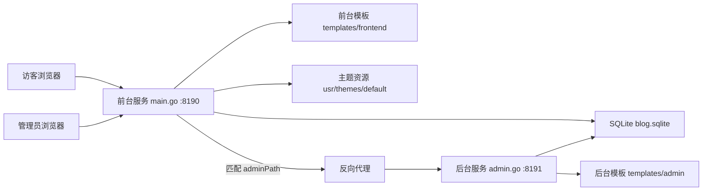

# Go-TeBlog 项目说明与架构文档

本文档面向二次开发接手使用，基于当前代码结构整理项目职责、运行方式、数据模型、主要路由和后续改造建议。

## 1. 项目定位

Go-TeBlog 是一个用 Go 实现的轻量博客系统，数据结构尽量兼容 Typecho。项目使用 SQLite 作为本地数据库，使用 Gin 提供 HTTP 服务，前台页面使用 Go HTML 模板渲染，后台提供文章、分类、评论、附件、用户、设置、备份等管理能力。

当前项目采用“双进程”设计：

- 前台服务：由 `main.go` 编译，默认监听 `8190`。
- 后台服务：由 `admin.go` 和 `admin_helpers.go` 编译，默认监听 `8191`。
- 前台服务会根据后台路径配置，把后台请求反向代理到 `8191`。

## 2. 技术栈

- 语言：Go
- Web 框架：Gin
- 数据库：SQLite，驱动为 `modernc.org/sqlite`
- Markdown 渲染：Goldmark
- 模板：Go `html/template`
- 前端：原生 HTML、CSS、JavaScript
- 部署：`build.sh` 编译两个二进制并注册 systemd 服务

## 3. 目录结构

```text
.
├── main.go                         # 前台博客服务：文章展示、评论、统计、sitemap
├── admin.go                        # 后台管理服务：登录、仪表盘、文章/评论/分类/用户/设置/备份
├── admin_helpers.go                # 后台辅助逻辑：登录限制、Cookie、安全过滤、系统信息
├── admin_helpers_test.go           # 后台辅助逻辑测试
├── go.mod                          # Go 依赖声明
├── build.sh                        # Linux 部署脚本，编译 blog_app 和 admin_app
├── templates/
│   ├── frontend/                   # 前台模板
│   └── admin/                      # 后台模板
├── usr/
│   └── themes/default/             # 前台默认主题资源
├── static/                         # favicon 等根路径静态资源
├── tools/
│   └── tosqlite.go                 # MySQL/PostgreSQL 到 SQLite 的 Typecho 数据迁移工具
└── screenshot/                     # 项目截图
```

## 4. 运行架构



请求入口默认是 `8190`。后台路径默认为 `/admin`，但会从数据库配置项 `adminPath` 读取。当前前台服务把匹配后台路径的请求转发到后台服务。

## 5. 前台服务

文件：`main.go`

主要职责：

- 初始化 SQLite 表结构和默认配置。
- 渲染博客首页、分类页、搜索页、归档页、文章详情页。
- 处理评论提交。
- 渲染 Markdown 内容。
- 输出 `sitemap.xml`。
- 提供 `/usr` 和 `/blog/usr` 静态资源访问。
- 记录访问统计。
- 使用 Beacon 区分真实访问和机器人流量。
- 将后台路径请求反向代理到 `8191`。

主要前台路由：

```text
GET  /blog
GET  /blog/
GET  /blog/index.php
POST /blog
GET  /blog/index.php/page/:page
GET  /blog/index.php/search/:keyword
GET  /blog/index.php/category/:slug
GET  /blog/index.php/:year/:month
GET  /blog/index.php/archives/:cid
GET  /blog/archives/:cid
POST /blog/index.php/archives/:cid/comment
GET  /sitemap.xml
GET  /api/stats/beacon
```

前台核心数据结构：

- `Post`：文章数据。
- `Category`：分类数据。
- `Comment`：评论数据。
- `Tag`：标签数据。
- `SiteInfo`：站点配置。
- `SkinConfig`：主题皮肤配置。
- `PageData`：首页、分类、搜索、归档页面模板数据。
- `PostDetailData`：文章详情页模板数据。

## 6. 后台服务

文件：`admin.go`、`admin_helpers.go`

主要职责：

- 管理员登录和会话管理。
- 访客只读模式。
- 仪表盘统计。
- 文章新增、编辑、删除、置顶、隐藏。
- 评论审核、隐藏、编辑、回复、删除。
- 分类管理、排序、首页显示控制、下线控制。
- 附件管理和引用清理。
- 用户新增、编辑、删除、密码修改。
- 系统设置、皮肤设置。
- 数据库和上传目录备份。
- 数据库 VACUUM。
- 重启前台和后台 systemd 服务。

主要后台路由以 `adminPath` 为前缀，默认是 `/admin`：

```text
GET  /admin/login
POST /admin/login
GET  /admin/dashboard
GET  /admin/profile
POST /admin/profile
GET  /admin/settings
POST /admin/settings
GET  /admin/settings/skin
POST /admin/settings/skin
GET  /admin/posts
GET  /admin/edit/:cid
POST /admin/save
POST /admin/post/delete/:cid
POST /admin/post/toggle/:cid
POST /admin/post/toggle-top/:cid
GET  /admin/comments
POST /admin/comment/toggle/:coid
POST /admin/comment/approve/:coid
POST /admin/comment/delete/:coid
POST /admin/comment/edit/:coid
POST /admin/comment/reply/:coid
GET  /admin/categories
POST /admin/category/save
POST /admin/category/reorder
POST /admin/category/delete/:mid
GET  /admin/attachments
POST /admin/attachment/delete/:cid
GET  /admin/users
GET  /admin/user/add
POST /admin/user/add
GET  /admin/user/edit/:uid
POST /admin/user/edit/:uid
POST /admin/user/delete/:uid
GET  /admin/backups
POST /admin/backups/create
POST /admin/backups/delete/:filename
POST /admin/backups/vacuum
POST /admin/system/restart
POST /admin/upload
```

后台安全相关逻辑：

- 登录 Cookie 名称：`te_auth`。
- 会话存储在 `go_sessions` 表。
- 登录失败限制由 `loginAttemptLimiter` 实现。
- Cookie 使用 `HttpOnly` 和 `SameSite=Lax`。
- HTTPS 请求下 Cookie 会设置 `Secure`。
- `visitor` 用户组通过 `writeProtectMiddleware` 禁止写操作。

## 7. 数据库设计

数据库文件默认位于项目根目录：

```text
blog.sqlite
```

项目分两类表：

### Typecho 兼容表

这些表用于兼容 Typecho 内容结构：

- `typecho_contents`：文章、页面等内容。
- `typecho_comments`：评论。
- `typecho_metas`：分类、标签等元数据。
- `typecho_relationships`：文章和分类/标签关系。
- `typecho_options`：站点配置。
- `typecho_users`：用户。

### Go-TeBlog 扩展表

这些表是项目自有功能扩展：

- `go_sessions`：后台登录会话。
- `go_options`：后台扩展配置。
- `go_category_settings`：分类首页显示和下线状态。
- `go_stats_logs`：访问统计日志。

## 8. 配置来源

项目主要配置来自数据库：

- `typecho_options`：站点标题、描述、关键词、主题、站点 URL、时区等。
- `go_options`：后台路径、会话超时、统计配置、分类设置等扩展配置。

重要配置项包括：

- `adminPath`：后台访问路径。
- `sessionTimeout`：后台会话超时时间。
- `theme`：当前主题。
- `siteUrl`：站点 URL。
- `timezone`：时区，默认 `Asia/Shanghai`。

## 9. 模板与主题

前台模板：

- `templates/frontend/index.html`
- `templates/frontend/post.html`
- `templates/frontend/error.html`

后台模板：

- `templates/admin/admin_dashboard.html`
- `templates/admin/admin_posts.html`
- `templates/admin/admin_edit.html`
- `templates/admin/admin_comments.html`
- `templates/admin/admin_categories.html`
- `templates/admin/admin_attachments.html`
- `templates/admin/admin_users.html`
- `templates/admin/admin_user_edit.html`
- `templates/admin/admin_settings.html`
- `templates/admin/admin_profile.html`
- `templates/admin/admin_backups.html`
- `templates/admin/admin_login.html`
- `templates/admin/admin_error.html`
- `templates/admin/admin_shared.html`

主题资源：

```text
usr/themes/default/
```

前台模板通过 `SiteInfo.ThemeBase` 加载主题 CSS 和 JS。皮肤颜色、圆角、布局间距等由 `SkinConfig` 注入到页面 CSS 变量。

## 10. 构建与部署

生产部署脚本是 `build.sh`，主要流程：

1. 要求 root 权限。
2. 确保 `usr/uploads` 下存在独立 `go.mod`，避免上传目录中的 Go 文件被主模块扫描。
3. 执行 `go mod tidy`。
4. 编译前台：

```bash
go build -o blog_app main.go
```

5. 编译后台：

```bash
go build -o admin_app admin.go admin_helpers.go
```

6. 首次安装时初始化管理员账号：

```bash
./admin_app --init-user=admin --init-pass=your-password
```

7. 创建并重启 systemd 服务：

```text
blog
blogadmin
```

本地开发时建议分别运行：

```bash
go run main.go
go run admin.go admin_helpers.go
```

注意：不要直接使用 `go run .` 或 `go test ./...` 作为当前结构的默认检查方式，因为 `main.go` 和 `admin.go` 都在同一个 `package main` 下，且各自定义了 `main()` 和部分重复符号。

## 11. 数据迁移工具

目录：`tools/`

`tools/tosqlite.go` 用于把 MySQL 或 PostgreSQL 中的 Typecho 数据转换为 SQLite。它会创建兼容的 `typecho_*` 表结构，并生成 `blog.sqlite`。

迁移大致流程：

1. 进入 `tools` 目录。
2. 运行转换工具。
3. 输入源数据库类型、地址、账号、数据库名和表前缀。
4. 得到 `blog.sqlite`。
5. 把 `blog.sqlite` 移动到项目根目录。
6. 同步旧站附件目录到 `usr/uploads`。

## 12. 当前二开目录状态

当前 C 盘开发副本已经合并了旧本地项目里的改动：

- 后台登录页标题和品牌已改为“老王 Blog”。
- 后台登录页增加欢迎文案。
- 前台监听地址从 `127.0.0.1:8190` 改为 `0.0.0.0:8190`。
- 后台代理目标从 `127.0.0.1:8191` 改为 `0.0.0.0:8191`。
- `go.mod` 中部分依赖版本已更新。
- 旧项目中的本地二进制和预览 HTML 文件也已复制过来。

## 13. 已知问题和二开建议

### 13.1 当前测试方式会失败

当前执行 `go test ./...` 会失败，原因是 `main.go` 和 `admin.go` 同属 `package main`，并且同时声明：

- `main()`
- `SkinConfig`
- `cfBlockedIPRule`
- `systemTimeLocation`
- 多个皮肤配置校验函数
- 多个时区辅助函数

这不是单个业务逻辑错误，而是当前“双入口单包”结构导致的编译冲突。

建议改造方向：

- 方案 A：保持两个入口，但拆成 `cmd/blog/main.go` 和 `cmd/admin/main.go`。
- 方案 B：把公共逻辑抽到 `internal/core`、`internal/db`、`internal/config`、`internal/security`。
- 方案 C：前后台合并为单进程，通过 Gin route group 区分前台和后台。

推荐优先采用方案 A 或 B，风险较低，也方便保留现有部署方式。

### 13.2 代码集中度较高

当前 `main.go` 和 `admin.go` 都很大，新增功能时容易互相影响。建议逐步拆分：

```text
internal/
├── config/       # 配置读写
├── db/           # 数据库初始化和查询
├── frontend/     # 前台 handler
├── admin/        # 后台 handler
├── security/     # 登录、Cookie、限流
├── stats/        # 访问统计和 Beacon
└── view/         # 模板数据结构和渲染辅助
```

### 13.3 中文内容存在编码显示问题

当前 README、脚本和部分模板中的中文在本环境下显示为乱码。建议确认文件编码并统一为 UTF-8。否则后续修改中文文案、模板和部署输出时容易继续扩大乱码范围。

### 13.4 `go.sum` 被忽略

当前 `.gitignore` 中忽略了 `go.sum`。Go 项目通常建议提交 `go.sum`，这样构建更可复现。若后续准备长期维护，建议移除 `.gitignore` 中的 `go.sum`，并提交生成后的 `go.sum`。

### 13.5 反向代理目标地址

当前本地改动把后台代理目标改为：

```text
http://0.0.0.0:8191
```

作为监听地址使用 `0.0.0.0` 是合理的，但作为客户端请求目标通常更推荐：

```text
http://127.0.0.1:8191
```

如果部署时前台和后台在同一台机器，建议代理目标保留 `127.0.0.1`，后台监听地址可以使用 `0.0.0.0:8191` 或 `127.0.0.1:8191`，视安全策略决定。

## 14. 推荐二开路线

建议按以下顺序继续：

1. 统一编码为 UTF-8，先修复 README、脚本、模板中的乱码。
2. 调整工程结构，拆分前后台入口，解决 `go test ./...` 编译冲突。
3. 决定是否提交 `go.sum`，提升依赖可复现性。
4. 清理二进制文件和预览 HTML 是否需要纳入版本管理。
5. 把前台、后台、公共 DB 查询逐步模块化。
6. 再开始新增业务功能，例如主题、文章扩展字段、SEO、评论风控、后台 UI 优化等。

## 15. 快速接手清单

开发前先确认：

- 当前工作目录是否是 C 盘开发副本。
- `blog.sqlite` 是否存在。
- `usr/uploads` 是否已迁移。
- 前台服务是否能单独编译：

```bash
go build -o blog_app main.go
```

- 后台服务是否能单独编译：

```bash
go build -o admin_app admin.go admin_helpers.go
```

- 后台路径 `adminPath` 是否符合预期。
- 配置是否已正确设置。

如果只是做页面和文案修改，优先查看：

- 前台：`templates/frontend/`、`usr/themes/default/`
- 后台：`templates/admin/`

如果要做内容管理逻辑，优先查看：

- 文章列表和编辑：`admin.go` 中 `/posts`、`/edit/:cid`、`/save`
- 评论管理：`admin.go` 中 `/comments` 和 `/comment/*`
- 分类管理：`admin.go` 中 `/categories` 和 `/category/*`
- 前台文章展示：`main.go` 中 `getPosts`、`getPost`、`handlePost`

